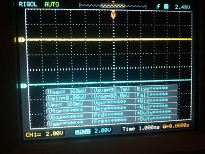
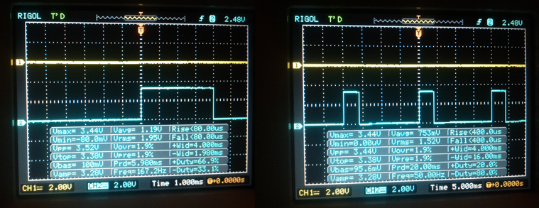
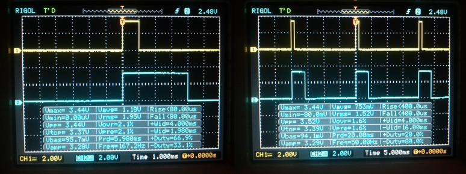
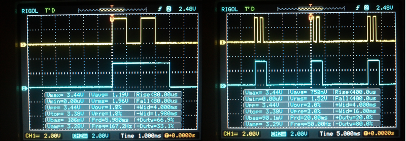

.. _ref-rpio-pwm-py:

``RPIO.PWM``, PWM via DMA for the Raspberry Pi
==============================================

``RPIO.PWM`` provides PWM via DMA for the Raspberry Pi, using the onboard PWM module for 
semi-hardware pulse width modulation with a precision of up to 1µs.

With ``RPIO.PWM`` you can use any of the 15 DMA channels and 
any number of GPIOs per channel. Since the PWM is done via DMA, ``RPIO.PWM`` uses almost zero CPU 
resources and can generate stable pulses with a very high resolution. 
``RPIO.PWM`` is implemented in C (`source <https://github.com/metachris/RPIO/blob/master/source/c_pwm/>`_); 
you can use it in Python via the provided wrapper, as well as directly from your C source.

``RPIO.PWM`` provides low-level methods to control everything manually, as well as helper
classes that simplify PWM for specific usages (such as ``RPIO.PWM.Servo``). This module is currently
in beta, please send feedback to chris@linuxuser.at. As of yet only BCM GPIO numbering is supported.

Examples
--------

Example of using ``PWM.Servo`` (with the default subcycle time of 20ms and default pulse-width
increment granularity of 10µs)::

    from RPIO import PWM

    servo = PWM.Servo()

    # Set servo on GPIO17 to 1200µs (1.2ms)
    servo.set_servo(17, 1200)

    # Set servo on GPIO17 to 2000µs (2.0ms)
    servo.set_servo(17, 2000)

    # Clear servo on GPIO17
    servo.stop_servo(17)

Example of using the low-level PWM methods::

    from RPIO import PWM

    # Setup PWM and DMA channel 0
    PWM.setup()
    PWM.init_channel(0)

    # Add some pulses to the subcycle
    PWM.add_channel_pulse(0, 17, 0, 50)
    PWM.add_channel_pulse(0, 17, 100, 50)

    # Stop PWM for specific GPIO on channel 0
    PWM.clear_channel_gpio(0, 17)

    # Shutdown all PWM and DMA activity
    PWM.cleanup()

``RPIO.PWM.Servo``
------------------

Here is a detailled overview of the ``RPIO.PWM.Servo`` class (from ``$ pydoc RPIO.PWM.Servo``)::

    class Servo
     |
     |  Methods defined here:
     |
     |  __init__(self, dma_channel=0, subcycle_time_us=20000, pulse_incr_us=10)
     |      Makes sure PWM is setup with the correct increment granularity and
     |      subcycle time.
     |
     |  set_servo(self, gpio, pulse_width_us)
     |      Sets a pulse-width on a gpio to repeat every subcycle
     |      (by default every 20ms).
     |
     |  stop_servo(self, gpio)
     |      Stops servo activity for this gpio

``RPIO.PWM``
------------

Low-level PWM method documentation (from ``$ pydoc RPIO.PWM``)::

    FUNCTIONS

        add_channel_pulse(dma_channel, gpio, start, width)
            Add a pulse for a specific GPIO to a dma channel (within the subcycle)

        cleanup()
            Stops all PWM and DMA actvity

        clear_channel(channel)
            Clears a channel of all pulses

        clear_channel_gpio(channel, gpio)
            Clears one specific GPIO from this DMA channel

        get_channel_subcycle_time_us(channel)
            Returns this channels subcycle time in us

        get_pulse_incr_us()
            Returns the currently set pulse width increment granularity in us

        init_channel(channel, subcycle_time_us=20000)
            Setup a channel with a specific subcycle time [us]

        is_channel_initialized(channel)
            Returns 1 if this channel has been initialized, else 0

        is_setup()
            Returns 1 if setup(..) has been called, else 0

        print_channel(channel)
            Print info about a specific channel to stdout

        set_loglevel(level)
            Sets the loglevel for the PWM module to either PWM.LOG_LEVEL_DEBUG for all
            messages, or to PWM.LOG_LEVEL_ERRORS for only fatal error messages.

        setup(pulse_incr_us=10, delay_hw=0)
            Setup needs to be called once before working with any channels.

            Optional Parameters:
                pulse_incr_us: the pulse width increment granularity (deault=10us)
                delay_hw: either PWM.DELAY_VIA_PWM (default) or PWM.DELAY_VIA_PCM

    CONSTANTS

        DELAY_VIA_PCM = 1
        DELAY_VIA_PWM = 0
        LOG_LEVEL_DEBUG = 0
        LOG_LEVEL_ERRORS = 1
        PULSE_WIDTH_INCREMENT_GRANULARITY_US_DEFAULT = 10
        SUBCYCLE_TIME_US_DEFAULT = 20000
        VERSION = '0.9.1'

Under the hood
--------------

Take a look at the `C source code on Github <https://github.com/metachris/RPIO/blob/master/source/c_pwm/>`_
for more details.

Subcycles
^^^^^^^^^

Each DMA channel is setup with a specific subcycle, within which pulses 
are added, and which will be repeated endlessly. Servos, for instance, 
typically use a subcycle of 20ms, which will be repeated 50 times a second.
You can add pulses for multiple GPIOs, as well as multiple pulses for
one GPIO. Subcycles cannot be lower than 2ms.

For more information about subcycles, see the examples below. The left oscilloscope
images zoom in on one subcycle, the right-handed images are zoomed out to show their repetition.

Pulse-width increment granularity
^^^^^^^^^^^^^^^^^^^^^^^^^^^^^^^^^

The pulse-width increment granularity (10µs by default) is used for all DMA channels 
(since its passed to the PWM timing hardware). Pulses are added to a subcycle by
specifying a ``start`` and a ``width`` parameter, both in multiples of the granularity.
For instance to set 500µs pulses with a granularity setting of 10µs, 
you'll need to set the pulse-width as 50 (50 * 10µs = 500µs). 

The pulse-width granularity is a **system-wide setting** used by the PWM hardware, 
therefore you cannot use different granularities at the same time, even in different processes.

Example with Oscilloscope
-------------------------

In the oscilloscope images, GPIO 15 the blue channel and GPIO 17 the yellow one. The left 
oscilloscope images show one subcycle, the right images are 'zoomed out' to show their repitition.
First we setup PWM.Servo with the default 20ms subcycle and 10µs pulse-width
increment granularity::

    from RPIO import PWM
    servo = PWM.Servo()

Now set a 4000us (4ms) pulse every 20ms for GPIO 15::

    servo.set_servo(15, 4000)

Now a 1000us (1ms) pulse for GPIO 17::

    servo.set_servo(17, 1000)

We can use the low-level PWM methods to add further pulses to a subcycle. This is done in multiples
of the pulse-width increment granularity (``start=200*10µs=2000µs``, ``width=100*10µs=1000µs``)::

    PWM.add_channel_pulse(0, 17, start=200, width=100)

