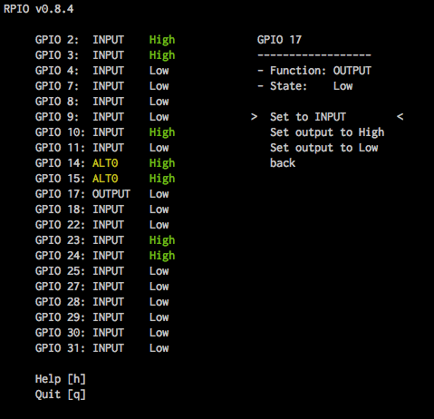
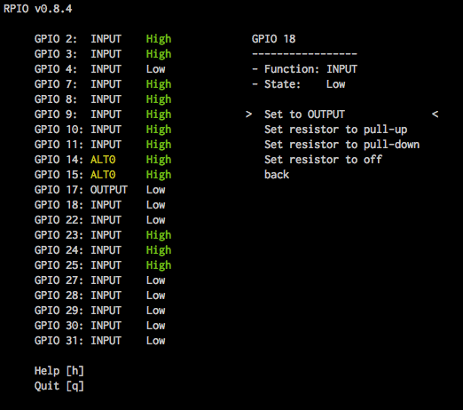

.. _ref-rpio-cmd:

``rpio``, the command line tools
================================

``rpio`` includes two command-line tools which allow you to inspect and manipulate GPIO's system wide
(including those used by other processes). The BCM GPIO numbering scheme is used by default.

* ``rpio``, a command-line tool to inspect and manipulate GPIOs
* ``rpio-curses``, ``rpio`` with a graphical user interface for the terminal

``rpio-curses``
---------------
``rpio-curses`` is a graphical user interface for the terminal to inspect and manipulate GPIOs. Its part of RPIO since
version 0.8.4. With ``rpio-curses`` you can see all GPIOs on the board with function and state, and change every 
possible parameter. The list is updated every second, and instantly if you change something. You can start ``rpio-curses`` in the command line by typing::

    $ rpio-curses

Here are a few screenshots of ``rpio-curses`` in action:

``rpio``
--------
``rpio --inspect-all`` (or ``-I``) is perhaps the most popular command, which shows you all gpios
on the board, with function and state. Here is an overview of all the functions of ``rpio``:

::

    Show the help page:

        $ rpio -h

    Inspect the function and state of gpios (with -i/--inspect):

        $ rpio -i 7
        $ rpio -i 7,8,9
        $ rpio -i 1-9

        # Example output for `rpio -i 1-9` (non-existing are ommitted):
        GPIO 2: ALT0   (1)
        GPIO 3: ALT0   (1)
        GPIO 4: INPUT  (0)
        GPIO 7: OUTPUT (0)
        GPIO 8: INPUT  (1)
        GPIO 9: INPUT  (0)

    Inspect all GPIO's on this board (with -I/--inspect-all):

        $ rpio -I

    Set GPIO 7 output to `1` (or `0`) (with -s/--set):

        $ rpio -s 7:1

        You can only write to pins that have been set up as OUTPUT. You can
        set this yourself with `--setoutput <gpio-id>`.

    Wait for interrupt events on GPIOs (with -w/--wait_for_interrupts). You
    can specify an edge (eg. `:rising`; default='both') as well as `:pullup`,
    `:pulldown` or `pulloff`.

        $ rpio -w 7
        $ rpio -w 7:rising
        $ rpio -w 7:falling:pullup

        $ rpio -w 7:rising:pullup,17,18
        $ rpio -w 1-9

    Setup a pin as INPUT (optionally with software resistor):

        $ rpio --setinput 7
        $ rpio --setinput 7:pullup
        $ rpio --setinput 7:pulldown

    Setup a pin as OUTPUT (optionally with an initial value (0 or 1)):

        $ rpio --setoutput 8
        $ rpio --setoutput 8:1

    Show Raspberry Pi system info:

        $ rpio --sysinfo

        # Example output:
        000e: Model B, Revision 2.0, RAM: 256 MB, Maker: Sony

You can update the ``RPIO`` package to the latest version (equivalent to ``easy_install -U RPIO``)::

    $ rpio --update-rpio

Install (and update) the ``rpio`` manpage::

    $ rpio --update-man
    $ man rpio
